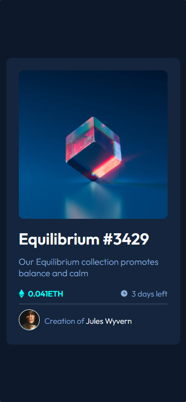

# Frontend Mentor - solução do cartão de visualização NFT

Esta é uma solução para o [desafio do componente do cartão de visualização NFT no Frontend Mentor](https://www.frontendmentor.io/challenges/nft-preview-card-component-SbdUL_w0U).

## Índice

   - [O desafio](#o-desafio)
   - [Captura de tela](#captura-de-tela)
- [Meu processo](#meu-processo)
   - [Construído com](#construído-com)
   - [O que aprendi](#o-que-aprendi)
- [Autor](#autor)
- [Agradecimentos](#acknowledgments)

### O desafio

Criar um cartão de visulização da NFT responsivo com as informações sobre a mesma e sobre o criador. Nesse desafio os usuários devem ser capazes de:

- Ver o layout ideal dependendo do tamanho da tela do dispositivo
- Veja os estados de foco para elementos interativos

### Captura de tela




## Meu processo

### Construído com

- Marcação HTML5 semântica
- Propriedades personalizadas CSS
- Flexbox

### O que eu aprendi

Consegui reforçar bastante meus conhecimentos sobre CSS, como: pseudo-classes e pseudo-elementos. Também consegui reforça minhas boas praticas com clean code e semântica do HTML 5

```css
.cartao .imagem-nft:hover::before {
    content: '';

    background-color: hsl(178, 100%, 50%);

    width: 100%;
    height: 300px;

    border-radius: 10px;

    position: absolute;

    opacity: 0.4;

    cursor: pointer;
}
```
## Autor

- Frontend Mentor - [@luis-fernand0](https://www.frontendmentor.io/profile/luis-fernand0)
- Instagram - [@_fernando_csc](https://www.instagram.com/_fernando_csc)

## Agradecimentos

Apesar de ter concluido este desafio sozinho, quero agradecer aos gemêos do [Dev em Dobro](https://www.instagram.com/devemdobro), estam me ajudando bastante no processo de desenvolvimento da minha carreira como programdor.